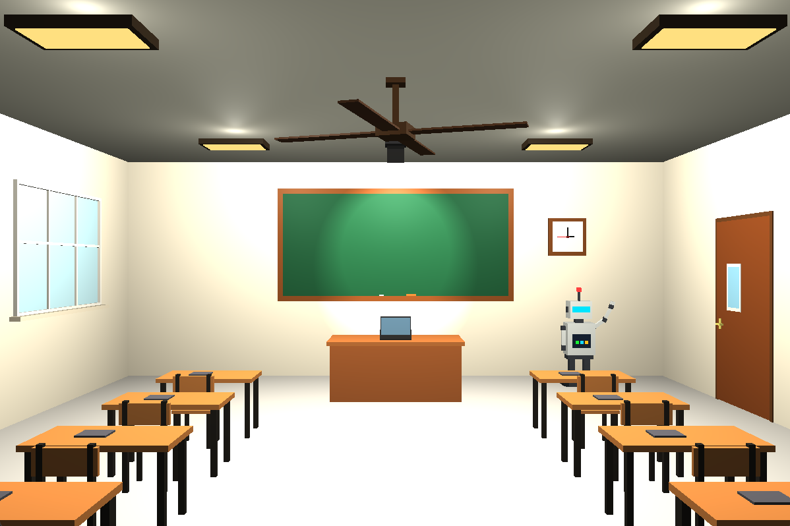
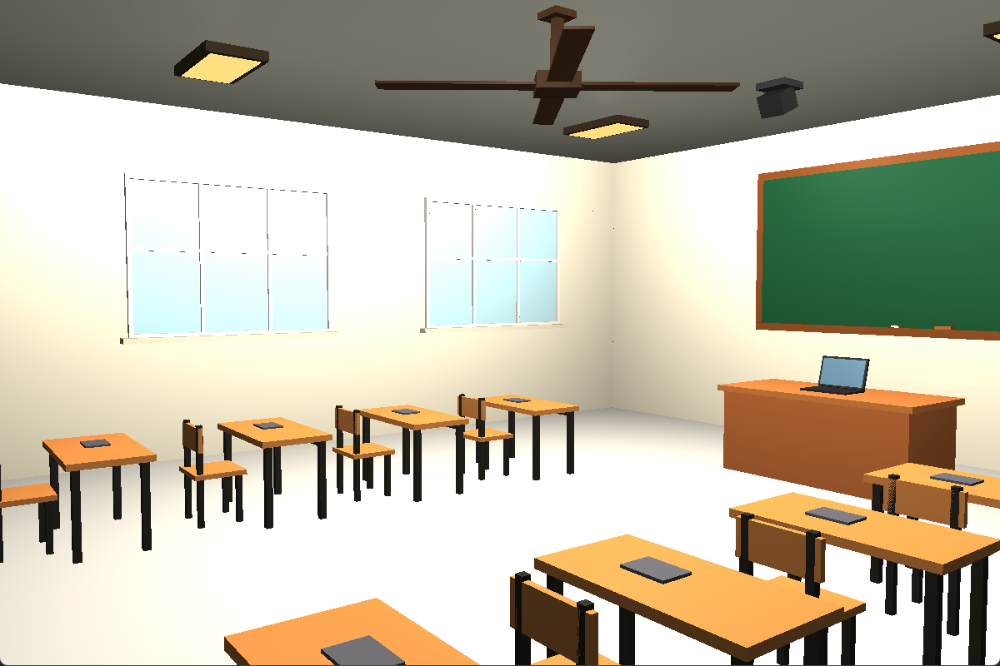
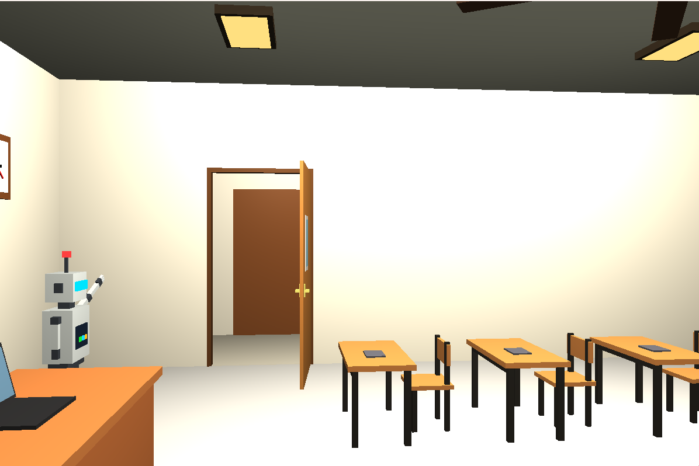
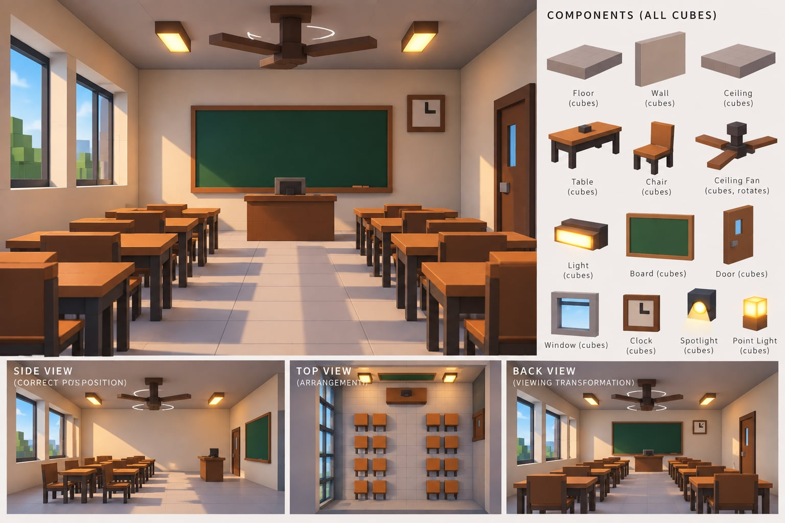

# Computer-Graphics-3D-Classroom

A feature-rich, interactive **3D Virtual Classroom & Embedded Robotics Laboratory** developed in C++ using **Modern OpenGL (3.3 Core Profile)** and **GLFW**. The project satisfies all core curriculum requirements for 3D Computer Graphics: **hierarchical 3D modeling transformations**, **viewing transformations**, **animated moving objects**, **multi-light Phong reflection shading** (Point Lights and Spotlight), and rich material properties.

---

## 📺 Project Demo Video

[](https://www.youtube.com/watch?v=-0teRdISEI4)

▶️ **Watch the demonstration on YouTube**: [https://www.youtube.com/watch?v=-0teRdISEI4](https://www.youtube.com/watch?v=-0teRdISEI4)

---

## 📸 Project Screenshots

| Back View (Main Perspective & Robot) | Left Wall (Windows & Outdoor View) |
| :---: | :---: |
|  |  |

| Right Wall (Animated Door, Hallway & Podium) | Original Classroom Reference |
| :---: | :---: |
|  |  |

### Detailed Views & Highlights

#### 1. Back View (Initial Main Perspective)
Looking down the classroom center aisle towards the chalkboard, wall clock, teacher's podium, student desks, and the continuous "bye-bye" waving robot:
<p align="center">
  
</p>

#### 2. Left Wall (Realistic Windows & Outdoor Daylight Campus Scenery)
Architectural hollow white casings, protruding interior stone sill shelf, 6 divided glass panes with mullions, and an outdoor scenery backdrop featuring sunny blue sky, sunlight glow, lawn, and green trees:
<p align="center">
  
</p>

#### 3. Right Wall (Animated Doorway, Corridor & Lighting)
Animated door with dynamic wood color transition (deep walnut when closed, shifting to illuminated warm golden honey-oak when open), revealing a modeled school corridor outside with tiled floor and warm ceiling lamp:
<p align="center">
  
</p>

---

## 🌟 Key Features & Engineering Highlights

### 1. Embedded Classroom: 4 Student Robotics Workstations
Four student tables (2 on the left, 2 on the right) are modeled as specialized **Embedded Systems & Robotics Laboratory Workstations**. Each workstation includes an open **3D student laptop** with a glowing cyan/blue IDE terminal and syntax-highlighted code lines:
- **Table 1: Left Front (`c=0, r=0`) — Microcontroller & Sensor Kit**:
  - Arduino Uno development board (cyan PCB, ATmega328P DIP IC with pins, USB port, power jack, female I/O headers, glowing power LED).
  - Prototyping breadboard with jumper wires (Red, Blue, Yellow).
  - HC-SR04 ultrasonic distance sensor with dual metallic eyes.
  - SG90 micro servo motor with white horn.
  - USB connection cable directly linking the student laptop to the Arduino.
- **Table 2: Left 2nd (`c=0, r=1`) — Articulated Robotic Arm Workstation**:
  - 3-DOF articulated desktop robotic arm with rotating turntable base, shoulder servo, industrial orange arm links, elbow joint, wrist pivot, and dual-finger metallic gripper holding a red test block.
  - Rugged safety-yellow Digital Multimeter (DMM) with LCD display, rotary selector dial, and probe test leads.
- **Table 3: Right 2nd (`c=1, r=1`) — Spider Bot & IoT Prototyping**:
  - 4-legged articulated quadruped spider bot with cyan legs, glowing core beacon, and pan-tilt camera head.
  - ESP32 IoT board with glowing bright blue 0.96" OLED screen and rechargeable LiPo battery pack.
- **Table 4: Right 3rd (`c=1, r=2`) — Autonomous Mobile Robotics Rover**:
  - 2-wheel differential-drive mobile robotics car with rubber tires, yellow TT gear motors, front brass caster, battery box, red L298N motor driver with finned aluminum heatsink, front obstacle sensors, and green power LED.
  - Translucent blue partitioned hardware organizer tray.
  - **Zero Overlap**: Dedicated physical coordinate clearances ($X \le -0.14\text{m}$ for laptop, $X \ge 0.045\text{m}$ for robotics hardware).

### 2. Ceiling Multimedia Projector & Dynamic Whiteboard Screen
- **Multimedia Projector**: Modeled ceiling drop fixture with mounting flange, extension pole, matte white body angled $25^\circ$, ventilation grills, status LEDs (green when active, amber on standby), and an optical projection lens that illuminates when active.
- **Synchronized Spotlight & Whiteboard (`P` / `S`)**: Pressing **`P`** activates the projector spotlight beam and instantly transforms the front dark green chalkboard into a pure white presentation screen.
- **Permanent Accessories**: Exactly **one felt-padded duster** and **one marker** permanently rest on the bottom tray across both green board and white screen modes.

### 3. Teacher Podium & Human-Ergonomic Orientation
- **Teacher Chair**: Rotated $180^\circ$ around the $Y$-axis with its contoured wooden seat tucked neatly into the desk knee opening ($Z = -0.445\text{m}$) and backrest positioned cleanly behind the teacher ($Z = -0.785\text{m}$).
- **Teacher Laptop**: Scaled to $1.25\times$ ($35\,\text{cm}$ width) flush on top of the podium ($Y = 0.91\text{m}$) and rotated $180^\circ$ so the keyboard and illuminated IDE screen face the teacher, while the sleek space-grey anodized aluminum back lid faces the classroom.

### 4. Four Distinct Animated Moving Objects
1. **Ceiling Fan**: Continuous smooth rotation around the vertical Y-axis (`F` to toggle, `+`/`-` to adjust speed).
2. **Wall Clock Second Hand**: Continuous **clockwise** rotation around the Z-axis calibrated to real-world speed ($6.0^\circ/\text{s}$, 1 full revolution in 60s).
3. **Interactive Classroom Door**: Animated smooth opening and closing on its vertical hinge (`D`), featuring dynamic wood color darkening and open hallway visibility.
4. **3D Classroom Robot**: Stationed beside the blackboard, featuring glowing electric-cyan visor eyes, chest status LEDs, and an articulated right arm that **continuously waves "bye-bye"** to the room!

### 5. Multi-Source Lighting & Coordinated Controls
- **4 Ceiling Point Lights**: Evenly distributed ceiling fixtures with distance attenuation ($k_c, k_l, k_q$).
- **Independent Controls (`5`, `6`, `7`, `8`)**: Keys `5`, `6`, `7`, and `8` toggle each ceiling light and its fixture diffuser independently.
- **Master Light Switch (`L`)**: Kept unchanged; toggles all 4 ceiling lights simultaneously.
- **Directional Spotlight**: Projector beam illuminating the presentation board.

### 6. Architectural Realism & Depth Fighting Elimination
- **Z-Fighting Resolution**: Decoupled the depth planes between the vertical steel upright posts ($Z \in [0.14\text{m}, 0.18\text{m}]$) and the wooden backrest panel ($Z \in [0.113\text{m}, 0.135\text{m}]$), completely eliminating zebra striping.
- **Window Scenery**: Outdoor lawn grass positioned completely outside the interior wall ($X \le -5.35\text{m}$), eliminating depth collision with the window sill.
- **Modeled Hallway / Corridor**: Opening the door reveals a modeled school corridor outside with tiled flooring, far corridor wall, and an emissive warm ceiling light fixture, eliminating black voids.

---

## 🎮 Master Controls Reference (1 Key = 1 Action)

All interactive controls follow a **1 Key = 1 Action** design principle with intuitive mnemonic key matching:

### 1. Master Control Cheat Sheet
| Category | Key | Action Word | What Happens on Screen |
| :--- | :---: | :--- | :--- |
| **Walk Navigation** | `↑` / `↓` | **Up / Down Arrow** | Walk forward / backward through the classroom |
| | `←` / `→` | **Left / Right Arrow** | Smoothly turn and pan camera view left / right |
| **Elevation** | `Shift + ↑` / `↓` | **Shift + Up / Down** | Fly camera vertically upward / downward |
| **Strafe** | `Shift + ←` / `→` | **Shift + Left / Right** | Slide sideways left / right without turning |
| **Camera Views** | `1` | Preset **1** | Back View (Entrance looking down central aisle) |
| | `2` | Preset **2** | Side View (Profile view of desks & windows) |
| | `3` | Preset **3** | Top View (Overhead bird's-eye layout) |
| | `4` | Preset **4** | Teacher View (Behind podium looking at students) |
| **Objects** | `D` | **D** for **D**oor | Smoothly opens ($85^\circ$) or closes the door leaf |
| | `F` | **F** for **F**an | Toggles ceiling fan rotation On / Off |
| | `+` / `-` | **Plus / Minus** | Increases / decreases fan rotation speed |
| **Lighting** | `5` | Light **1** | Toggles Front-Left ceiling light & diffuser |
| | `6` | Light **2** | Toggles Front-Right ceiling light & diffuser |
| | `7` | Light **3** | Toggles Back-Left ceiling light & diffuser |
| | `8` | Light **4** | Toggles Back-Right ceiling light & diffuser |
| | `L` | **L** for **L**ight | Master switch: toggles all 4 ceiling lights (Unchanged) |
| | `P` *(or `S`)* | **P** for **P**rojector | Toggles projector spotlight & switches board to white screen |
| **Reset** | `R` | **R** for **R**eset | Resets camera, room transformations, projector & lights |
| **Room Rotation** | `X`, `Y`, `Z` | Axes **X, Y, Z** | Tilts, spins, or rolls the room (`Shift` reverses) |
| **Room Move** | `T` + Arrows | **T** for **T**ranslate | Shifts entire classroom in 3D (`Shift` for height) |
| **Room Scale** | `M` + `↑`/`↓` | **M** for **M**agnify | Scales entire classroom larger or smaller |
| **System** | `Esc` | **Esc**ape | Closes application window |

---

## 🛠️ Build & Run Instructions

### Prerequisites
- Visual Studio 2022 / Visual Studio 2026 (MSVC v143 or v145 toolset)
- OpenGL 3.3 compatible graphics drivers
- GLFW3 and GLAD (configured in project settings)

### Building with MSBuild (Command Line)
```powershell
& "C:\Program Files\Microsoft Visual Studio\18\Community\MSBuild\Current\Bin\MSBuild.exe" "Lighting.sln" /p:Configuration=Debug /p:Platform=x64
```

### Running the Application
```powershell
& "x64\Debug\Lighting.exe"
```

### Building in Visual Studio IDE
1. Open `Lighting.sln` in Visual Studio.
2. Select **Debug** configuration and **x64** platform.
3. Press **F5** (Local Windows Debugger) to compile and launch.

---

## 👨‍💻 Author & Repository

- **Author**: Fardin Hossain
- **Repository**: [Computer-Graphics-3D-Classroom](https://github.com/fardinhossain/Computer-Graphics-3D-Classroom.git)
- **Demo Video**: [YouTube Walkthrough](https://www.youtube.com/watch?v=-0teRdISEI4)
